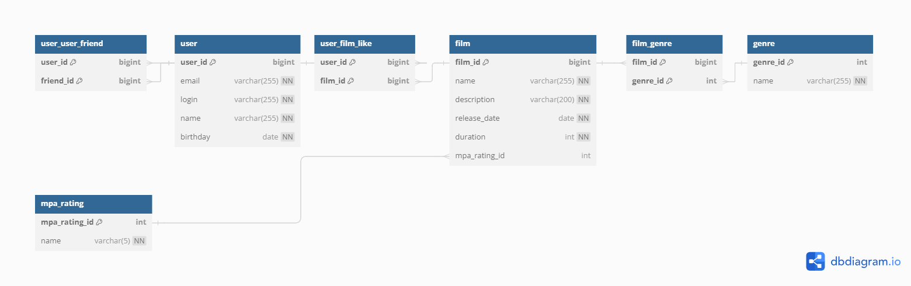

# java-filmorate

## ER-diagram



[or you can check it directly at dbdiagram.io](https://dbdiagram.io/d/669d0dc78b4bb5230eeae03e)

## SQL query examples

* Get all mutual friends of a user by #user_id
```sql
SELECT
    *
FROM
    user
WHERE
    user_id IN (SELECT
                    user_id
                FROM 
                    user_user_friend
                WHERE 
                    friend_id = #user_id
                    AND user_id IN (SELECT 
                                        friend_id
                                    FROM 
                                        user_user_friend
                                    WHERE 
                                        user_id = #user_id));
```

* Get #count most popular (with most likes) films
```sql
SELECT
    *
FROM
    film
WHERE
    film_id IN (SELECT
                    film_id
                FROM
                    user_film_like
                GROUP BY
                    film_id
                ORDER BY
                    COUNT(user_id) DESC
                LIMIT #count);
```